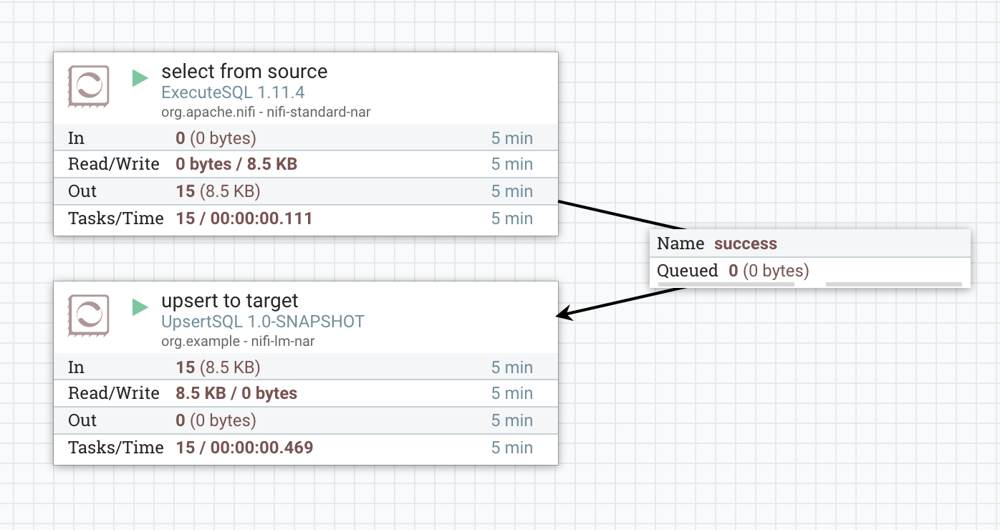

# nifi-lm-bundle

Experiments with LinkMove-like ETL over NiFi.

## UpsertSQL: simple table synchronization using "create-or-update" strategy

`UpsertSQL` is a custom NiFi processor provided by this project that takes a batch of input records, matches them with
the target table data, and automatically generates and runs a set of INSERT and UPDATE statements to synchronize the 
table data. It is idempotent and will generate a bare minimum of data modification statements.

_TODO: On success create a new FlowFile that tags the data from the original flow file with ETL outcome labels:
"inserted", "updated", "skipped". We already have this data available in the current processor._

